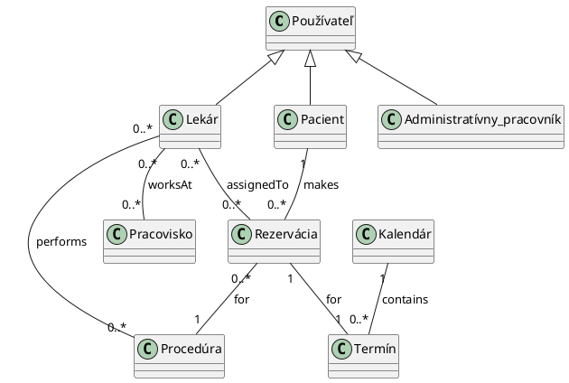

# MediCORE — Domain Model

## Class Diagram (PlantUML)


## Key Relationships Explained
- `Používateľ` is abstract — three concrete types: Pacient, Lekár, AdministratívnyPracovník
- `Rezervácia` is the central object — joins Pacient + Lekár + Termín + Procedúra
- `Kalendár` owns `Termín` objects (each Lekár has a Kalendár)
- `Termín` states: `DOSTUPNY` → `REZERVOVANY` → `UVOLNENY` / `ZRUSENY`
- `Rezervácia` states: `POTVRDENA` → `ZRUSENA` / `PRESUNUTÁ`

## SQLite Schema
```sql
CREATE TABLE IF NOT EXISTS pouzivatelia (
    id INTEGER PRIMARY KEY AUTOINCREMENT,
    meno TEXT NOT NULL,
    priezvisko TEXT NOT NULL,
    email TEXT UNIQUE NOT NULL,
    heslo_hash TEXT NOT NULL,
    typ TEXT NOT NULL  -- 'PACIENT', 'LEKAR', 'ADMIN'
);

CREATE TABLE IF NOT EXISTS pracoviska (
    id INTEGER PRIMARY KEY AUTOINCREMENT,
    nazov TEXT NOT NULL,
    budova TEXT,
    poschodie TEXT,
    miestnost TEXT
);

CREATE TABLE IF NOT EXISTS lekari (
    id INTEGER PRIMARY KEY,
    specializacia TEXT NOT NULL,
    pracovisko_id INTEGER REFERENCES pracoviska(id),
    FOREIGN KEY(id) REFERENCES pouzivatelia(id)
);

CREATE TABLE IF NOT EXISTS procedury (
    id INTEGER PRIMARY KEY AUTOINCREMENT,
    nazov TEXT NOT NULL,
    trvanie_min INTEGER NOT NULL,
    popis TEXT
);

CREATE TABLE IF NOT EXISTS lekar_procedury (
    lekar_id INTEGER REFERENCES lekari(id),
    procedura_id INTEGER REFERENCES procedury(id),
    PRIMARY KEY (lekar_id, procedura_id)
);

CREATE TABLE IF NOT EXISTS terminy (
    id INTEGER PRIMARY KEY AUTOINCREMENT,
    lekar_id INTEGER NOT NULL REFERENCES lekari(id),
    datum_cas DATETIME NOT NULL,
    trvanie_min INTEGER NOT NULL,
    stav TEXT NOT NULL DEFAULT 'DOSTUPNY'
);

CREATE TABLE IF NOT EXISTS rezervacie (
    id INTEGER PRIMARY KEY AUTOINCREMENT,
    pacient_id INTEGER NOT NULL REFERENCES pouzivatelia(id),
    lekar_id INTEGER NOT NULL REFERENCES lekari(id),
    termin_id INTEGER NOT NULL REFERENCES terminy(id),
    procedura_id INTEGER NOT NULL REFERENCES procedury(id),
    stav TEXT NOT NULL DEFAULT 'POTVRDENA',
    vytvorena_at DATETIME DEFAULT CURRENT_TIMESTAMP
);
```

## Java Model Notes
- `Pouzivatel` is abstract, extended by `Pacient`, `Lekar`, `AdministrativnyPracovnik`
- Use `String typ` field (`"PACIENT"`, `"LEKAR"`, `"ADMIN"`) stored in DB
- Password hashing: SHA-256 via `java.security.MessageDigest` — no external library
- Dates: `java.time.LocalDateTime`
- No ORM — plain JDBC with DAO pattern
